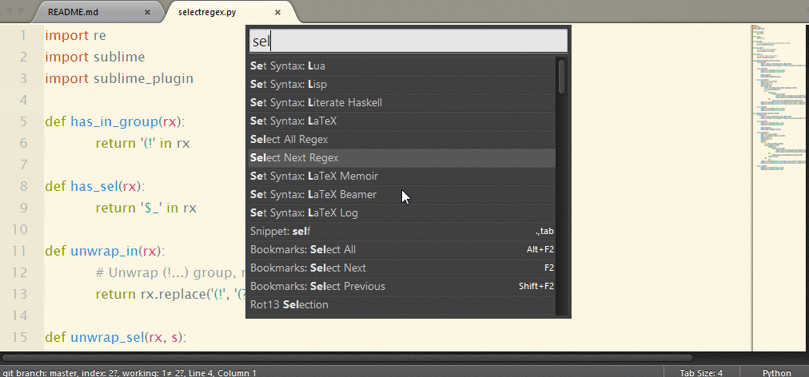

SublimeSelectRegex
==================

This plugin used to select by regex. Command `Select All Regex` selects all, `Select Next Regex` selects first found regex for each selection. 
Regex can also contain special group `(!...)`, which used to mark group, which will be actually selected. If there are no such group, entire regex will be selected. `Select Next Regex` can also use `$_` to match string under current selection.

