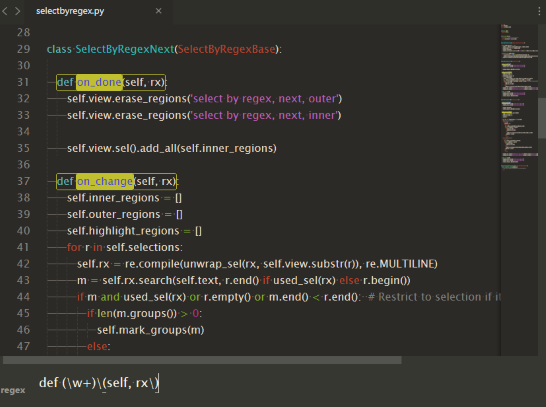

Select By Regex
==================

This plugin used to select by regex. Command `Select By Regex: All` selects all, `Select By Regex: Next` selects first found regex for each selection. If you want restrict search for line, use `Expand Selection to Line` before calling `Select By Regex` command. 
Regex can also contain special group `(!...)`, which used to mark group, which will be actually selected. If there are no such group, entire regex will be selected. `Select By Regex: Next` can also use `$_` to match string under current selection.

Bind to keys
---

You can use this keymap
<pre>
{
    "keys": ["ctrl+alt+f"],
    "command": "select_by_regex_next",
},
{
    "keys": ["ctrl+alt+a"],
    "command": "select_by_regex_all"
}
</pre>

