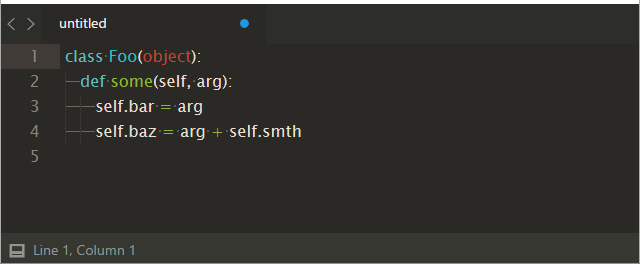
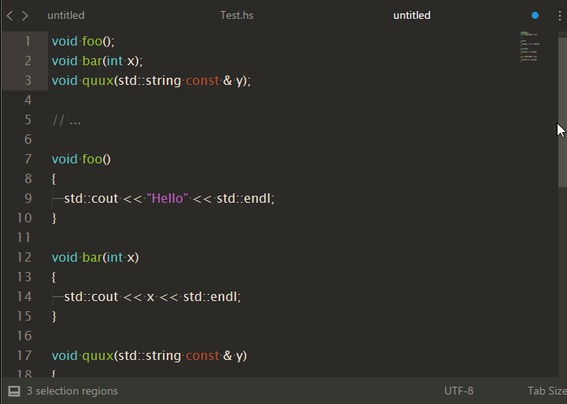

Select By Regex
==================

This plugin used to select by regex. Command `Select By Regex: All` selects all, `Select By Regex: Next` selects first found regex for each selection. If you want restrict search for line, use `Expand Selection to Line` before calling `Select By Regex` command. 
If regex contain groups, then groups will be select. To exclude group from selection use `(?:...)` group. `Select By Regex: Next` can also use `$_` to match string under current selection.

Bind to keys
---

You can use this keymap
<pre>
{
    "keys": ["ctrl+alt+f"],
    "command": "select_by_regex_next",
},
{
    "keys": ["ctrl+alt+a"],
    "command": "select_by_regex_all"
}
</pre>

